# Deploying Cloudflare Domains Manager
Cloudflare is a large network of servers that can improve the security, performance and, reliability of anything connected to the internet. 

Manage your Cloudflare domains with ease using the Cloudflare Domains Manager. This responsive and efficient application is built with a Vue.js frontend and a Python Flask backend.


This respository contain a Dockerfile to build and run the application in a docker container and a civo kubernetes cluster for running the application in a production environment.


## Prerequisites

Ensure the following prerequisites are installed on your machine:

### Container

- Docker

### IaC

- Terraform

### Orchestration tool

- Kubernetes

## To get started:

### 1. Cloning the repository: 

Fork and clone [this repository](https://github.com/Franklyn-dotcom/community-challenge)

``` git clone https://github.com/Franklyn-dotcom/community-challenge.git ```

### 2. Change the directory into your cloned repo:

```cd community-challenge```


#### 3. Set Environment Variables:

Rename and Replace the placeholders in the `.env.sample` to `.env` file with your actual Cloudflare credentials and configurations.

``` 
ZONE_ID=your_zone_id_here
CF_API_KEY=your_CF_API_KEY_here
CF_API_EMAIL=your_CF_API_EMAIL_here
VUE_APP_PROXY_URL=IP_ADDRESS_OF_YOUR_MACHINE 
```

### 4. Creating the Dockerfile
We will be creating a single [Dockerfile](./Dockerfile) to build the backend, frontend and nginx image to ensure Nginx is set up to serve the bundled Vue.js application and also route traffic to the Python Flask proxy accessible at `"/proxy/"`.

Copy and paste the following code into your Dockerfile:
```
# # Pulling a secured python image and using as our base image
FROM python:3.10-alpine as api
LABEL maintainer="Mbanugo mbanugofranklyn678@gmail.com"

# # change to the working directory 
WORKDIR /app

# # copy only the requirements file to cache dependencies
COPY requirements.txt .

# # installing the required dependencies
RUN pip install -r requirements.txt

# #set the working directory
COPY . .

# # set environmental variable for flask 
ENV FLASK_APP=main.py


# # expose the application on port 5000
EXPOSE 5000

CMD [ "flask", "run", "--host=0.0.0.0" ]


# create another base image for frontend application
FROM node:lts-alpine as web

# make the 'app' folder the current working directory
WORKDIR /app


# copy both 'package.json' and 'package-lock.json'
COPY package*.json ./

# install project dependencies
RUN npm install

# copy the all files and folders to the current directory
COPY . .


# run the application development
RUN npm run build


# another base image to route traffic to both the frontend and backend application
FROM nginx:alpine

# change to the working directoy
WORKDIR /app

# copy the frontend b
COPY --from=web /app/dist /app/dist

# remove the default nginx configuration file
RUN rm /etc/nginx/conf.d/default.conf

# copy new nginx.conf to the nginx directory
COPY nginx.conf /etc/nginx/conf.d/

# expose application on port 80
EXPOSE 80

# run the nginx application
CMD ["nginx", "-g", "daemon off;"]

```

### 5. Building and Pushing the docker image to docker hub using github actions 

After saving your Dockerfile, we will building and pushing the docker image using github actions. 

Check out [introduction to github actions](https://www.telerik.com/blogs/introduction-github-actions) to learn more about github actions.

(i) Create a `.github/workflows` directory

``` mkdir .github/workflows ```

(ii) Cd into the directory

``` cd .github/workflows ```

(iii) Create a main.yml file to store your workflow:

``` touch main.yml ```

You will need to create the credentials for the docker hub to enable you to push the image to docker hub or any private respository of your choice

(iv) Naviagte to your repository, Click on the `settings` and click on the `Secrets and Variables`

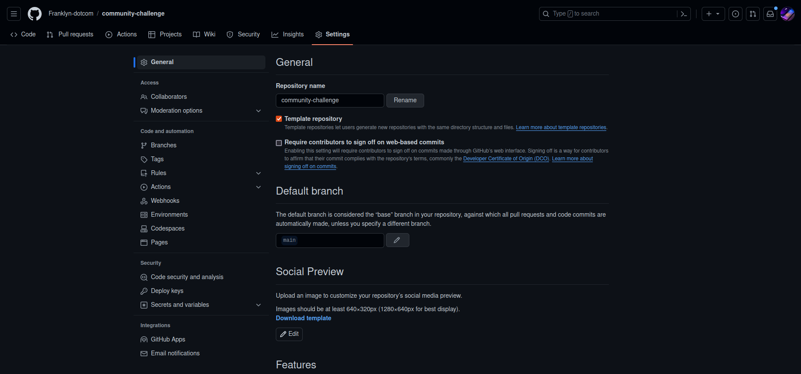


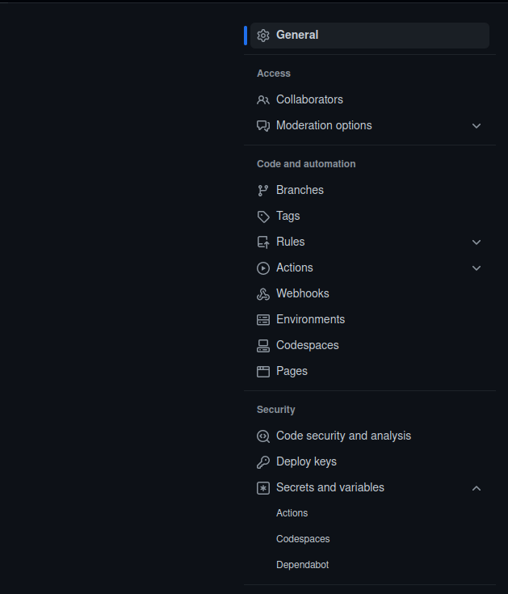


Then click on `Actions` 

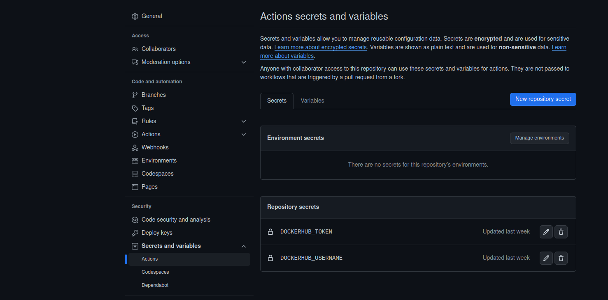

You can see, I have already created a secret to store my dockerhub username and password. 

To store your dockerhub or any private repository of your choice, click on the `New repository secret`

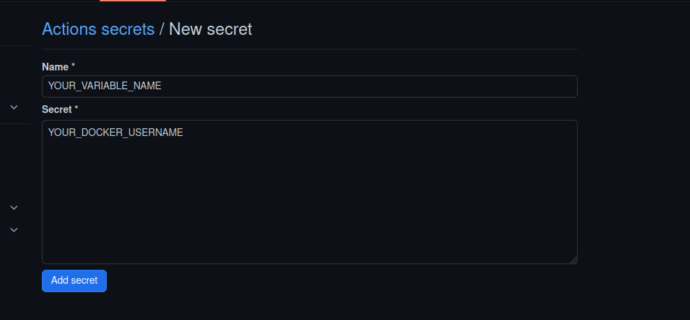

Replace the `YOUR_VARIABLE_NAME` with docker hub or your private repository.

In the `Secret` area, replace the `YOUR_DOCKER_USERNAME` with the username of your docker hub or your private repository username.

Click on the `Add secret` to save the secret.


We will repeat the same thing for the password


Replace the `YOUR_VARIABLE_NAME` with docker hub or your private repository.

In the `Secret` area, replace the `YOUR_DOCKERHUB_PASSWORD` with the username of your docker hub or your private repository username.

Click on the `Add secret` to save the secret.

You have successfully created your secrets to store your private repository credential!. 


(v) Copy and paste the following code into the `main.yml`

```
name: continuous integration

on:
  push:
    branches:
      - "main"

jobs:
  build:
    runs-on: ubuntu-latest
    steps:
      -
        name: Checkout
        uses: actions/checkout@v3
      -
        name: Login to Docker Hub
        uses: docker/login-action@v3
        with:
          username: ${{ secrets.DOCKERHUB_USERNAME }}
          password: ${{ secrets.DOCKERHUB_TOKEN }}

      -
        name: Build and push docker image for the backend
        uses: docker/build-push-action@v5
        with:
          context: .
          file: ./Dockerfile
          push: true
          tags: ${{ secrets.DOCKERHUB_USERNAME }}/cloudflare:2.0
          target: api
      -
        name: Build and push docker image for the frontend
        uses: docker/build-push-action@v5
        with:
          context: .
          file: ./Dockerfile
          push: true
          tags: ${{ secrets.DOCKERHUB_USERNAME }}/cloudflare:1.1
```

Replace the `${{ secrets.DOCKERHUB_USERNAME }}` and `${{ secrets.DOCKERHUB_TOKEN }}` with your own environment variable you saved in the `Action` page.

Once you are done adding the script and credentials, you need to git add, commit and push the file to your repo.


The workflow will be triggered in the response to your push event you created in your file.

``` 
on:
  push:
    branches:
      - "main"

```

To see your running workflow action, navigate to the Actions page, you can see the build running with the git commit message. To see the build running click on the git commit message. You can see, in my Actions my running commit message is `update files`

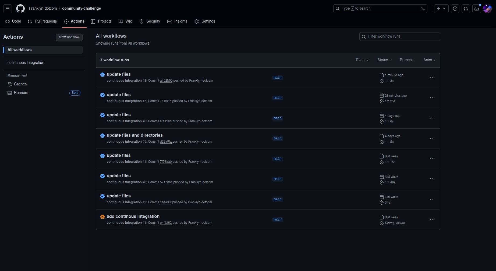

click on your running build, you will find the name of your job which you used in the `main.yml` file. 

```
jobs:
  build: # using the build as a reference to the name of the job  
    runs-on: ubuntu-latest
    steps:
```


Click on the <b>build</b>, you will find all your running jobs for your workflow.

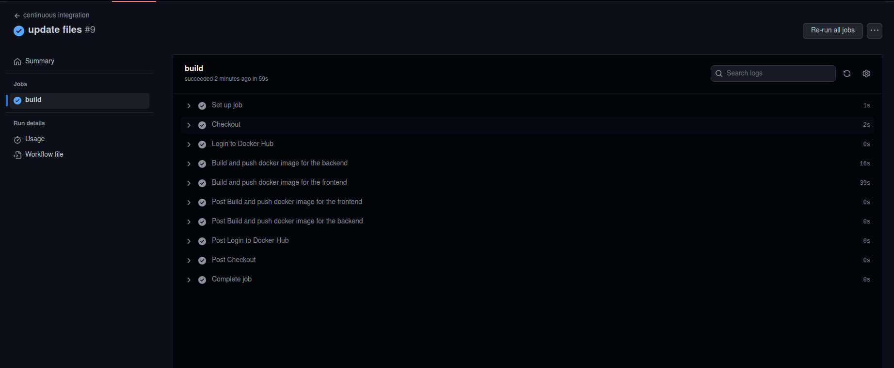

Now, you have succesfully build and push your docker image to private repository using continuous integration with github actions.


### 6. Pulling and running the docker image locally

In this step, we will be pulling and running our application locally using the `docker run` command.

run this command to pull your docker image from your private repository:

```
docker pull franklyn27181/cloudflare:2.0

docker pull franklyn27181/cloudflare:1.1

```
Replace the `franklyn27181/cloudflare:1.1 and franklyn27181/cloudflare:2.0` with your image name and tag.

You should see an output like this:


To view your docker image use the command below:

`docker images`

run the following command to run your docker image:

```
docker run -d -p 5000:5000 franklyn27181/cloudflare:2.0

docker run -d -p 80:80 franklyn27181/cloudflare:1.1
```


The container will run in detach mode using your built image.The backend container will be running on port 5000 and the frontend container will be running on port 80 or just using the url.

You can access your container on the web page using your ip address and the port you are using to run your containers. Like this:

`http://YOUR_IP_ADDRESS:5000` 


`http://YOUR_IP_ADDRESS`

i will be using `http://74.220.27.118` to run the containers.


You should see an output like this:


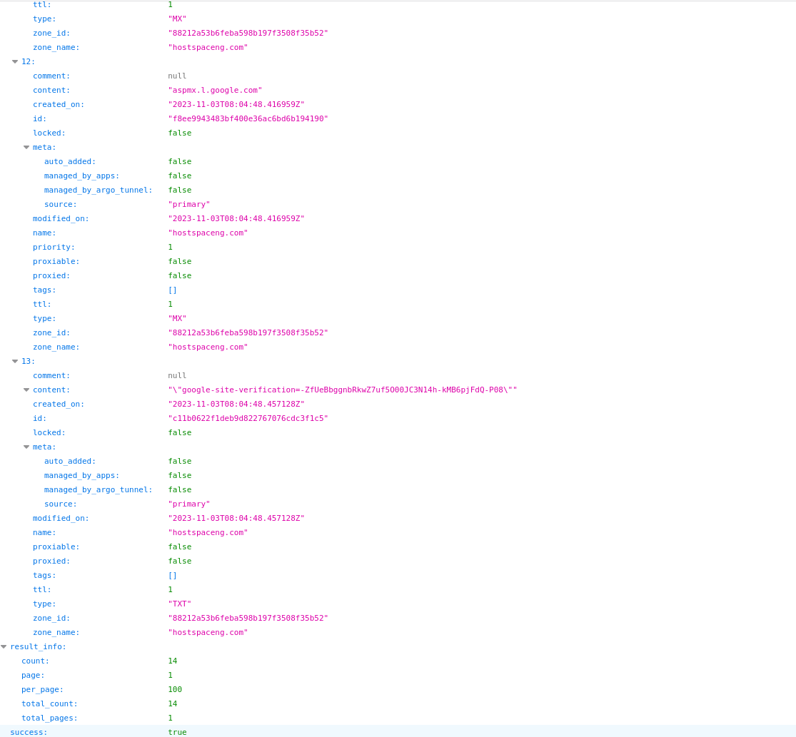

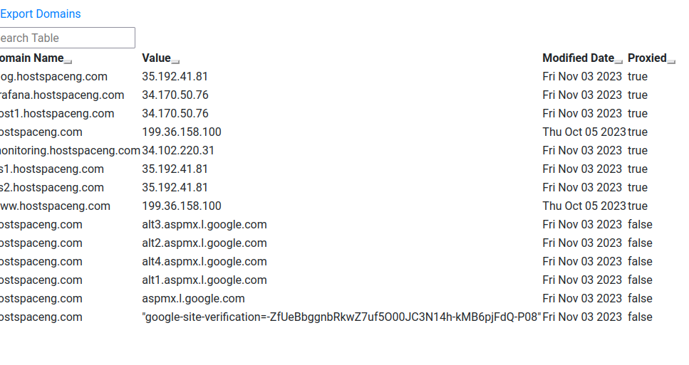


### 7. Automating the Kubernetes cluster using terraform

We will be automating our kubernetes cluster using terraform. We will using civo provider to manage the clusters. You can use any cloud provider of your choice.

(i) Create a `Iac` directory 
```
mkdir IaC
```

(ii) Change directory to the Iac directory
```
cd IaC
```

(iii) Create a `provider.tf` and `civo.tf` file. `The provider.tf` will be used to manage your provider infrastructure and the `civo.tf` will be used to automate your cluster.

```
touch provider.tf && touch main.tf
```

copy and paste the following code into your `provider.tf` and `civo.tf` file 

```
nano provider.tf # this command opens the file in an editor
```

```
terraform {
  required_providers {
    civo = {
      source = "civo/civo"
      version = "1.0.39"
    }
  }
}

provider "civo" {
  token = var.civo_token
  region = "FRA1"
}

```

Save the file.

Copy and paste the following code into your `civo.tf` file

```
nano main.tf
```


```
# Query small instance size
data "civo_size" "medium" {
    filter {
        key = "name"
        values = ["g4s.kube.medium"]
        match_by = "re"
    }

}


# Create a firewall
resource "civo_firewall" "my-firewall-demo" {
    name = "my-firewall-demo"
    
}

# Create a firewall rule
resource "civo_firewall_rule" "kubernetes_api" {
    firewall_id = civo_firewall.my-firewall-demo.id
    protocol = "tcp"
    start_port = "6443"
    end_port = "6443"
    cidr = ["0.0.0.0/0"]
    direction = "ingress"
    label = "kubernetes-api-server"
    action = "allow"
}


# Create a cluster with k3s
resource "civo_kubernetes_cluster" "k8s-cluster" {
    name       = "k8s-cluster"
  applications = ""
  firewall_id = civo_firewall.my-firewall-demo.id
  num_target_nodes = 3
  pools {
    node_count = 3
    size = element(data.civo_size.medium.sizes, 0).name
  }
}

```

After adding the files, save the file and exit the editor using `ctrl + o ` to save and `ctrl + x` to exit. 

Run the following commands:

`terraform init` To initialize your files and provider

`terraform plan` To see your resources that are being created 

`terraform apply` To apply the resources

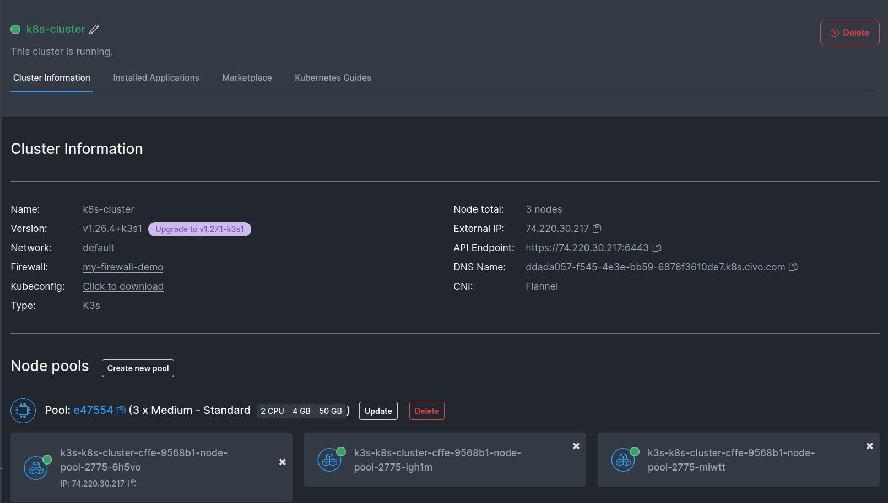

You have successfully created your Kubernetes cluster. Next, we will be automating the kubernetes manifest files to deploy the application to a LoadBalancer.

### 8. Creating and Automating kubernetes manifests

After applying your resources using terraform, You need to download the Kubernetes configuration file from the civo provider or the provider you created in the `provided.tf` file and store it in a `.kube/config` file before running the kubectl command.

To store the kubeconfig file in the `.kube/config` file:

(i) Create a `.kube/` directory and `cd` into the directory

`mkdir .kube/`

(ii) Create a config file in the `.kube/` directory and copy and paste your kubeconfig contents in the config file

`cd .kube/ && nano config`

Save and exit the file. 

(iii) Verify the kubectl command is running using:

``` kubectl apply -h ```

(iv) Create a `secret.yaml` file to store the value of the `CF_API_KEY` variable. The `CF_API_KEY` value is first encrypted before being added as a data to your file. 

Run the following command for encryption:

```
echo -n CF_API_KEY | base64 -w 0
```

Run the ``` kubectl apply -f secret.yaml``` to apply your secret resource.

(v) Create a `configmap.yaml` file to store your environment variables needed by the flask and vue application.

Copy and paste the following code in your `configmap.yaml` file: 

```
apiVersion: v1
kind: ConfigMap
metadata:
  name: application-configmap
data:
  zone_id: 88212a53b6feba598b197f3508f35b52 
  cf_api_email: safe@hostspaceng.com
#  vue_app_proxy: ''

```

Replace the value in the `zone_id` and `cf_api_email` with your zone_id and cf_api_email address

(vi) Create a single deployment and service file named `python-deployment-service.yaml` to create both the deployment and service used to serve the flask application. The application will be running on a `LoadBalancer` service type. 

copy and paste the following code into the file: 

```
apiVersion: apps/v1
kind: Deployment
metadata:
  name: python-flask-backend
  labels:
    app: python-flask-backend
spec:
  replicas: 2
  selector:
    matchLabels:
      app: python-flask-backend
  template:
    metadata:
      labels:
        app: python-flask-backend
    spec:
      containers:
      - name: python-flask-app-deployment
        image: franklyn27181/cloudflare:2.0
        ports:
        - containerPort: 5000
        env:
        - name: ZONE_ID
          valueFrom:
            configMapKeyRef:
              name: application-configmap
              key: zone_id
        - name: CF_API_EMAIL
          valueFrom:
            configMapKeyRef:
              name: application-configmap
              key: cf_api_email
        - name: CF_API_KEY
          valueFrom:
            secretKeyRef:
              name: application-secret
              key: cf_api_key


---
apiVersion: v1
kind: Service
metadata:
  name: python-flask-backend-service
spec:
  selector:
    app: python-flask-backend
  ports:
    - protocol: TCP
      port: 5000
      targetPort: 5000
  type: LoadBalancer

```

Run the following command to apply the resources: 

``` kubectl apply -f python-deployment-service.yaml```


(vii) Create a single deployment and service file named `vue-js-deployment-service.yaml` to create both the deployment and service used to serve the vue-js application. The application will be running on a `LoadBalancer` service type. 

copy and paste the following code into the file: 

``` 
apiVersion: apps/v1
kind: Deployment
metadata:
  name: vue-js-deployment
  labels:
    app: vue-js-frontend
spec:
  replicas: 2
  selector:
    matchLabels:
      app: vue-js-frontend
  template:
    metadata:
      labels:
        app: vue-js-frontend
    spec:
      containers:
      - name: vue-js-cloudflare
        image: franklyn27181/cloudflare:1.1
        ports:
        - containerPort: 80

---
apiVersion: v1
kind: Service
metadata:
  name: vue-js-frontend-service
spec:
  selector:
    app: vue-js-frontend
  ports:
  - protocol: TCP
    port: 80
    targetPort: 80
  type: LoadBalancer

```

Run the following command to apply the resources: 

``` kubectl apply -f vue-js-deployment-service.yaml```

After successfully creating and applying your manifest files. 

To see your running pods and services, run the following commands: 

<!-- To get the running pods for your resources-->

``` kubectl get pods ``` 

<!-- To get the running services for your resources  -->

``` kubectl get svc ```


The applications can be reached with the URLs in the EXTERNAL_IP running on a LoadBalancer.

The URL of the frontend `http://74.220.29.194`. Replace the URL with your LoadBalancer URL. 

To get the API of the flask application, append the `/proxy` to the LoadBalancer URL.

Copy and paste the URL in your browser and the output should look like this:

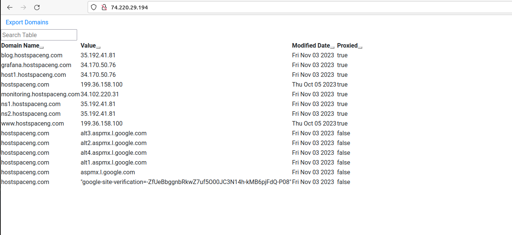

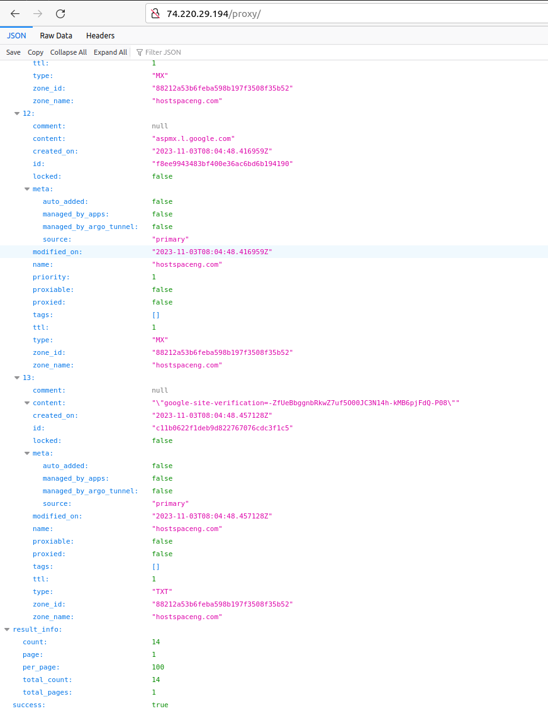


### 9. Monitoring the application using prometheus and grafana

In this step, we will be monitoring our application memory usage using grafana and prometheus.

We will be using the helm package manager to install both the prometheus and grafana with the help helm charts.

Helm is a package manager for kubernetes. 

To install helm, run the following command: 

```
$ curl -fsSL -o get_helm.sh https://raw.githubusercontent.com/helm/helm/main/scripts/get-helm-3
$ chmod 700 get_helm.sh
$ ./get_helm.sh
```

To install the helm chart for prometheus and grafana, run the following command:

```
helm repo add prometheus-community https://prometheus-community.github.io/helm-charts
helm repo update
helm install [RELEASE_NAME] prometheus-community/kube-prometheus-stack

```

Replace the `RELEASE_NAME` with your release name.

Run the following command to view the running pods and service for the prometheus and grafana server

``` 
kubectl get pods
```


```
kubectl get svc
```


In here, I have already configure the service type of the prometheus and grafana server to run on a LoadBalancer. 

To access the prometheus and grafana page, you need to configure the service type for both the prometheus and grafana service file. 

Run the following command to configure the service type:

```
kubectl get svc prometheus-kube-prometheus-prometheus -oyaml > prom.yaml

kubectl get svc prometheus-grafana -oyaml > gra.yaml
```
Nano into the file and navigate down to the type and change the `ClusterIP` to `LoadBalancer`.

Run the following code to apply the changes to the file:

``` kubectl apply -f prom.yaml ```

``` kubectl apply -f gra.yaml ```

After successfully applying the file. To get the service type, run the following command:

```
kubectl get svc
```


To view the page, copy and paste your `EXTERNAL_IP` address in your browser

Mine will be running on ``` http://74.220.29.49:9090 ``` for the prometheus server and ``` http://74.220.24.192 ``` for the grafana server.


Monitor Pod CPU and Memory usage: This dashboard is used to monitor the CPU and Memory usage of you applications in the pods in the kubernetes cluster.

In this step we have successfully been able to monitor our application memory usage using grafana and prometheus. 

With the following steps, you will be able to deploy the Vue application which communicates with the Flask API to generate Cloudflare Domains.